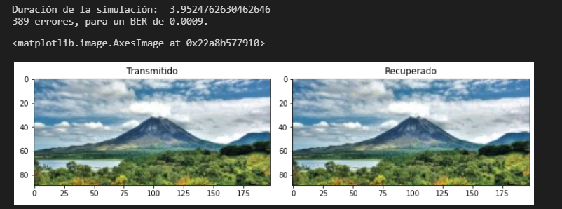
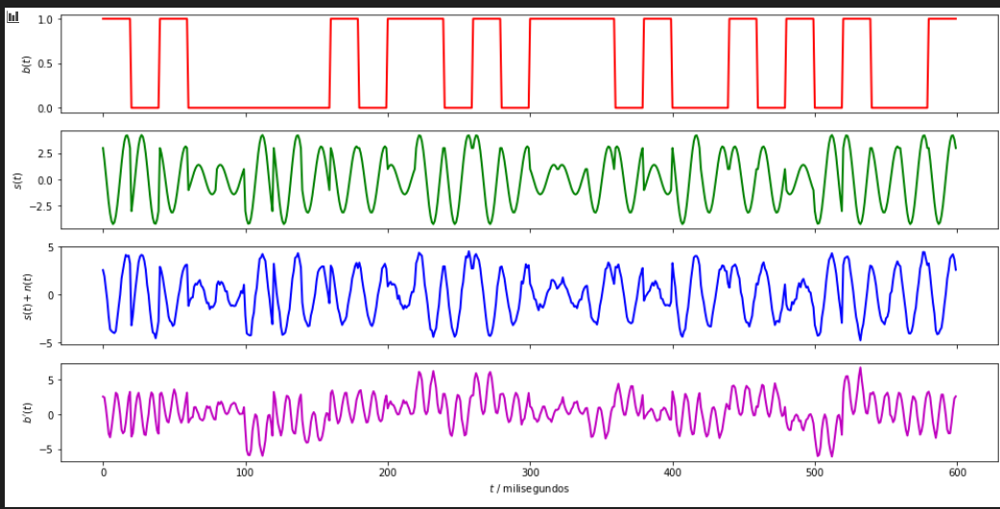
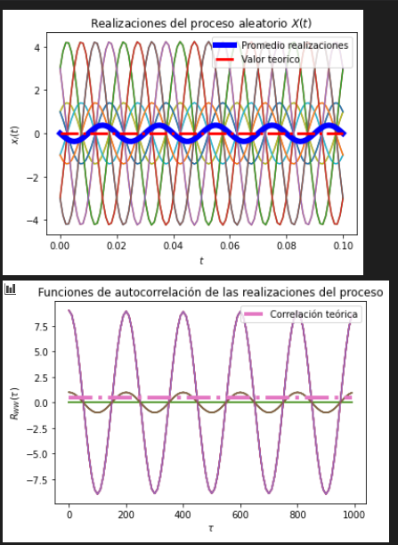
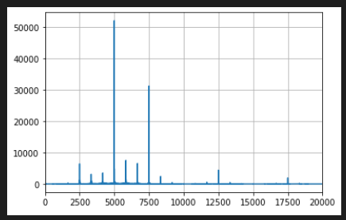

# Proyecto #4

El presente documento corresponde al proyecto #4 del curso Modelos Probabilisticos 
de Señales y Sistemas de la Universidad de Costa Rica, confeccionado por mi persona 
Luis Gabriel Masís Fernández en el semestre I-2021. 

## Resultados de inciso #4.1 (Modulación 16-QAM)

Como se puede observar en esta ocasión se logró recuperar la imagen 
de muy buena forma donde gracias al SNR se puede obtener una mejor o peor imagen, esto es 
de esperar ya que el ruido es el que causa que la imagen se pueda deteriorar. En 
este caso se utilizaron varios SNR y se concluyo que con uno mayor a 
25 la imagen no presentaba errores, se escogió 
colocar uno con errores para efectos de la visualizacion del código en acción. 
Además, se puede observar la forma de la señal tanto por separado como cuando estas 
son mezcladas en diversos momentos del tiempo de una forma que hace sentido. 

## Resultados de inciso #4.2 (Estacionaridad y Ergocidad)

Con estos resultados, se puede observar que la media es constante en todo momento 
y que además, la autocoreelacion es dependiente en todo momento del diferencial temporal 
Gracias a que no existe una variación sumamente grande se puede decir que es estacionario y además, 
se puede argumentar que es un proceso ergódico debido a que las medias estadísticas son iguales 
a las medias temporales. 

## Resultados de inciso #4.3 (Densidad espectral de potencia)

En estos resultados, se puede observar la densidad espectral de potencia, en esta 
imagen se tiene que los valores se encuentran alrededor de las frecuencias de las portadoras. El hecho
que exista más de una portadora no afecta ya que el número de símbolos se mantiene de la misma forma. La diferencia
que se tiene es que se recurre a menos bits para transmitir la señal ya que va analizando de 4 en 4. 
